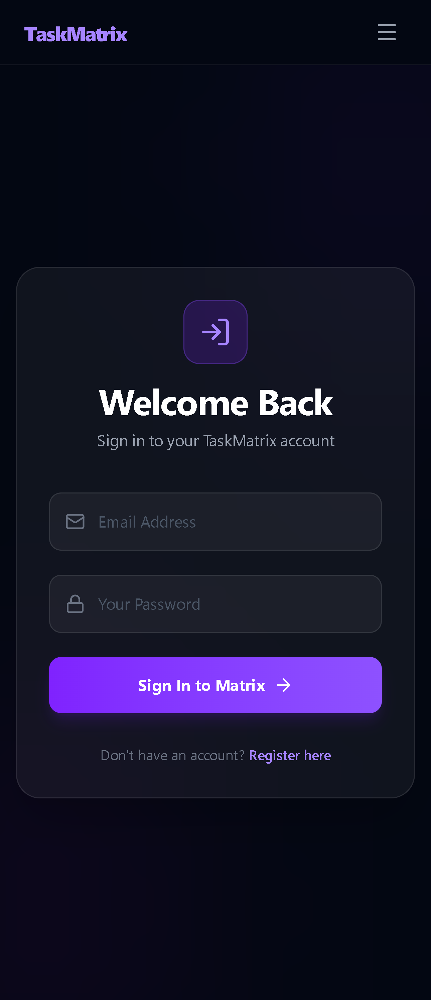
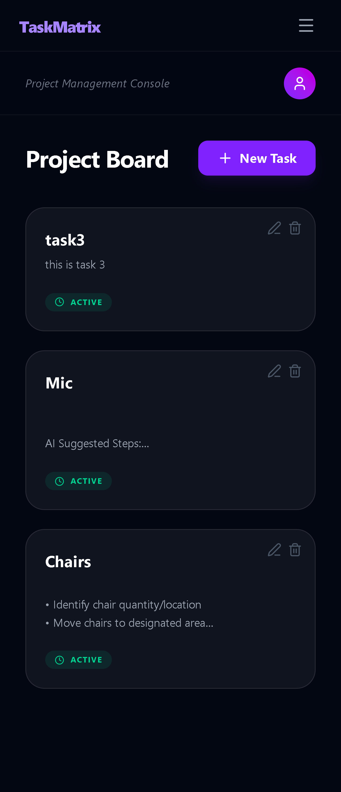

# 🚀 TaskMatrix | Week 16: The Polish & AI Injection

TaskMatrix has evolved from a functional task manager into a professional-grade **AI-SaaS** productivity tool. **Week 16** focused on the "Code Freeze" phase, dedicated to hardening backend security, integrating AI-driven sub-task generation, and refining the UI/UX for a premium user experience.

---

## 📸 Updated Preview

## 📺 Project Demo (Week 16 Update)

---

## 🌌 Core Features (Week 16 Milestones)

### 1. The AI Injection (Milestone 1)
- **AI Suggested Steps:** Powered by **Gemini 2.5 Flash**, TaskMatrix now automatically generates 3 actionable sub-tasks for any given task title, helping users overcome procrastination.
- **Secure Server-Side Calls:** All AI interactions happen on the Node.js backend to keep API keys hidden and secure.

### 2. Backend Hardening & Validation (Milestone 2)
- **Zod Schema Validation:** Implemented type-safe validation for all incoming API requests. If a user sends invalid or empty data, the backend blocks it with a graceful `400 Bad Request` response.
- **Standardized Error Handling:** Refactored all routes to use centralized `try/catch` blocks and proper HTTP status codes, ensuring the server remains stable even during failures.

### 3. Security & Performance (Milestone 3)
- **Express Rate Limiting:** Added a layer of protection against DDoS and API abuse. The `/api/ai/suggest` route is strictly throttled to manage AI quota efficiently.
- **Production Cleanup:** Removed unnecessary `console.log` statements and debuggers to optimize performance and security for a production environment.

### 4. Professional Polish
- **Global Auth State:** Refactored the frontend to use the **React Context API**, providing instant UI updates during login/logout without requiring page refreshes.
- **Micro-interactions:** Added loading spinners (Lucide-React), glassmorphism hover effects, and smooth transitions for a $20/month SaaS feel.

---

## 🛠️ Tech Stack Expansion
- **AI/ML:** Google Generative AI SDK (Gemini 1.5/2.5 Flash).
- **Validation:** Zod (Backend schema enforcement).
- **Security:** Express-rate-limit (API Throttling).
- **State Management:** React Context API (Auth Provider).
- **Icons:** Lucide-React.

---

## ⚙️ Technical Challenges Solved
1. **AI Output Sanitization:** Engineered a regex-based cleaning logic to handle cases where the AI returns Markdown code blocks instead of raw JSON strings.
2. **Standardized Status Codes:** Overhauled the error response system to ensure the frontend receives specific JSON error messages instead of generic crashes.
3. **Reactive Navigation:** Implemented a `PrivateRoute` wrapper that listens to the Auth Context, preventing unauthorized access more reliably than manual `localStorage` checks.

---

**Developed by [Shivansh Vishwakarma](https://github.com/technoshiva123)**  
*Full Stack Developer Intern @ Prodesk IT | Final Year BCA Student*
